# W4D1 — First Cluster: Multi-Tenancy and Pod Diagnostics

## Objective

Configure the `lama` namespace on the shared `aidc-t09` k3s cluster, diagnose three intentionally failing Pods, and deploy a validated serving Pod. The serving workload uses `MODEL_BACKEND=echo`; it is not a GPU-inference workload. The RTX A6000 work was a separate Kubernetes GPU scheduling test.

## Environment

| Item | Value |
| --- | --- |
| Cluster / namespace / node | `pod:aidc-t09` / `lama` / `aidc-t09` |
| GPU capacity | NVIDIA RTX A6000; `nvidia.com/gpu: 1` |
| Serving image | `sadeemalboqami/aidc-serving:cpu-v1` |
| Model configuration | `MODEL_BACKEND=echo`, `MODEL_ID=Qwen/Qwen2.5-0.5B-Instruct` |

## Workflow and results

1. Created and selected the `lama` namespace, then applied the supplied broken manifests to observe Kubernetes failure modes.

| Pod | Observed state | Diagnosis |
| --- | --- | --- |
| `pod-a` | `ErrImagePull` / `ImagePullBackOff` | The requested image tag did not exist. |
| `pod-b` | `Pending` | The scheduler reported `Insufficient cpu`. |
| `pod-c` | `Error` | The container terminated with exit code 3. |

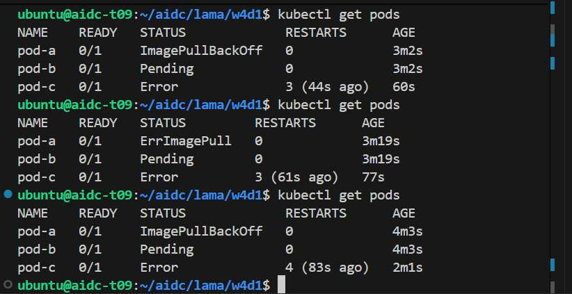

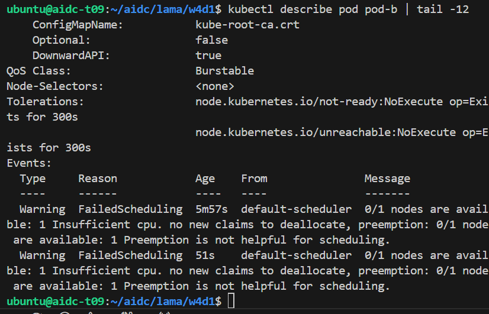

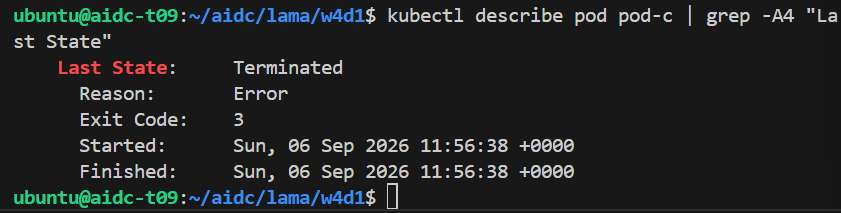

2. Deleted the diagnostic Pods, applied `pod.yaml`, and confirmed `serving` reached `1/1 Running`. Uvicorn started on port 8000.

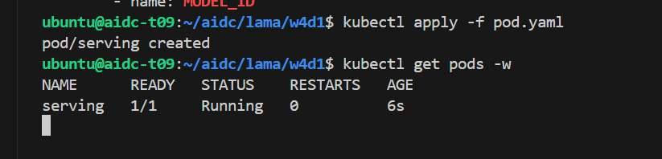

3. Validated the serving endpoints through a local port-forward to the Pod: `/health` returned `status: ok`; `/v1/models` listed `Qwen/Qwen2.5-0.5B-Instruct`; and `/v1/chat/completions` returned HTTP 200.

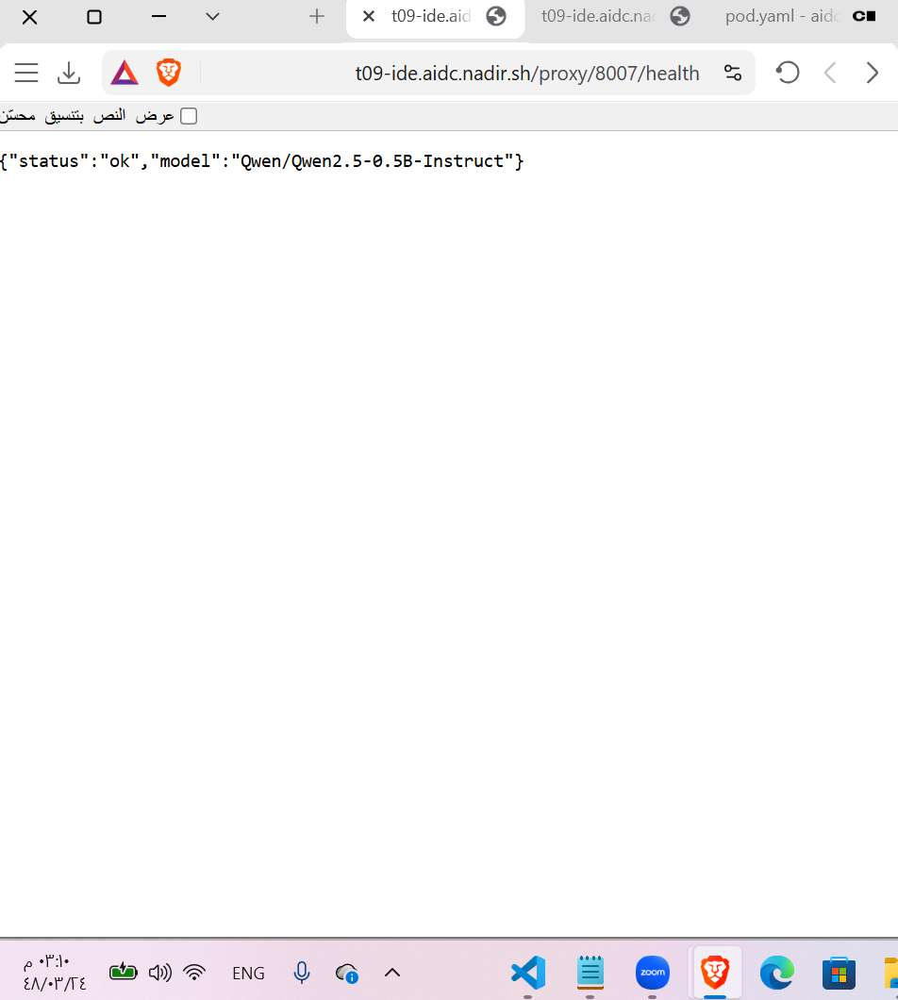

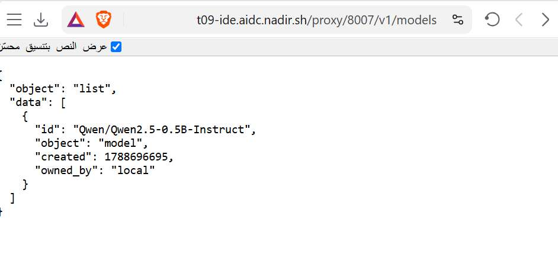

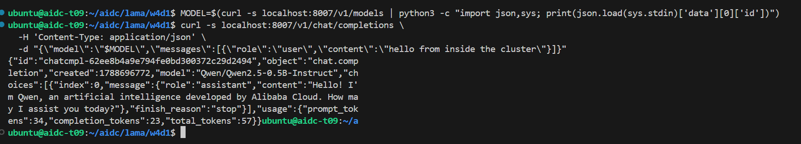

4. Ran the supplied validator. It generated `w4d1_evidence.json` and finished with **`GREEN CHECK: PASS`**.

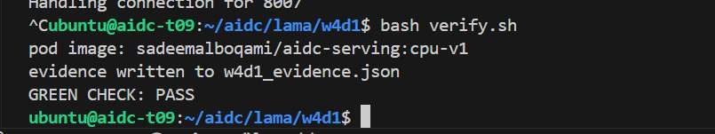

## Stretch: Pod lifecycle and GPU scheduling

The standalone `serving` Pod was deleted and did not recreate automatically. Reapplying `pod.yaml` reached Ready in **1.210 seconds**.

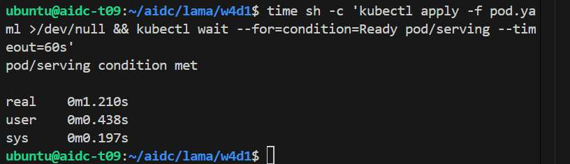

A `gpu-check` Pod requesting `nvidia.com/gpu: 1` ran successfully, and `nvidia-smi -L` inside it reported the NVIDIA RTX A6000. A `gpu-hold` Pod then reserved that only GPU; a second GPU-requesting Pod remained `Pending`, with `kubectl describe` reporting `Insufficient nvidia.com/gpu`.

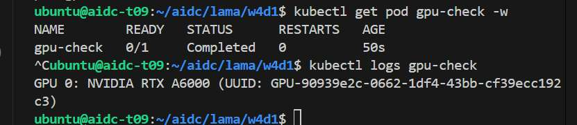

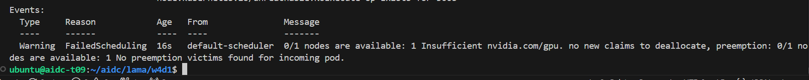

## Submission files

* `pod.yaml` is the supplied manifest with its required image placeholder replaced.
* `verify.sh` is the supplied validator, retained unchanged.
* `broken/` contains the supplied diagnostic manifests; only the permitted image-line replacement was made in `broken/pod-c.yaml`.
* `w4d1_evidence.json` is the validator output from the verified run.
