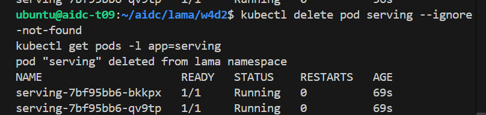
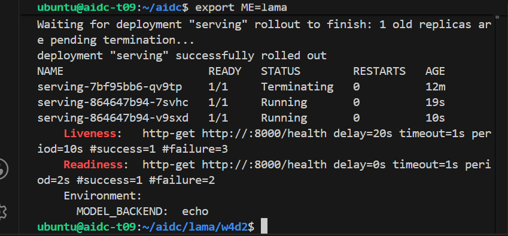
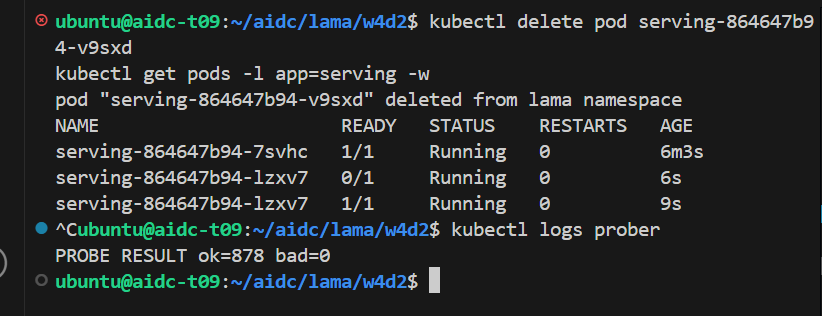
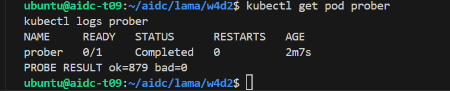
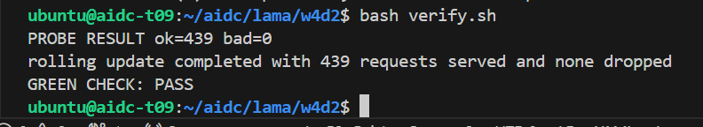

# W4D2 — Self-Healing Deployment and Zero-Downtime Rollout

## Objective

Replace the standalone W4D1 Pod with a two-replica Kubernetes Deployment and a stable Service endpoint, then demonstrate readiness gating, self-healing, and a zero-request-loss rolling update. The workload uses `MODEL_BACKEND=echo`; it is not real LLM or GPU inference.

## Configuration

| Component | Verified configuration |
| --- | --- |
| Deployment | `serving`, 2 replicas, `RollingUpdate` |
| Update policy | `maxUnavailable: 0`, `maxSurge: 1` |
| Container | `sadeemalboqami/aidc-serving:cpu-v1`, `MODEL_BACKEND=echo` |
| Health checks | readiness and liveness `GET /health` on port 8000 |
| Shutdown behavior | `preStop` sleep of 5 seconds |
| Service | `serving` on port 8000; the supplied Service uses Kubernetes’ default `ClusterIP` type |

## Evidence-based workflow

1. The standalone W4D1 `serving` Pod was deleted. The two Deployment-managed `serving` Pods remained Running, showing that the Deployment owns the desired replica count rather than the old standalone Pod.

2. The Deployment rolled out successfully with readiness and liveness probes on `/health:8000`. Readiness prevents traffic from reaching an unready Pod, while liveness provides recovery if a previously healthy container stops responding.

3. For self-healing, one Deployment-managed Pod was manually deleted. Kubernetes created a replacement, which progressed from `0/1 Running` to `1/1 Running`. A concurrent prober recorded **`PROBE RESULT ok=878 bad=0`**, demonstrating no failed health requests during replacement.

4. For the rolling-update traffic test, `APP_VERSION` changed from `v1` to `v2` and the rollout completed successfully. The prober recorded **`PROBE RESULT ok=879 bad=0`**, showing that the update maintained service continuity.

5. The supplied validator independently performed its rolling-update check and recorded **`PROBE RESULT ok=439 bad=0`**. Its final output confirms: **439 requests served and none dropped** and **`GREEN CHECK: PASS`**.

## Files

* `deployment.yaml` — supplied Deployment completed with the required image and health probes.
* `service.yaml` — supplied stable Service endpoint.
* `verify.sh` — supplied W4D2 validator, retained unchanged.
* `screenshots/` — five supplied execution-evidence pages.

No Constraint Card A/B/C result is recorded because no Constraint Card was provided for this lab.
