# Week 4 Day 3 — GPUs in the Scheduler's Ledger

## Objective

Examine how Kubernetes records and schedules CPU, memory, and GPU resources; demonstrate unschedulable requests; measure a CPU noisy-neighbour scenario; and verify the shared team GPU engine. CPU-only workloads in this lab use `MODEL_BACKEND=echo`; this README does not attribute GPU inference to them.

## Requests and limits

A **request** is the capacity Kubernetes schedules and accounts for before a Pod can run. A **limit** is the upper bound enforced for a container resource. The serving Deployment used requests of `250m` CPU and `256Mi` memory, with limits of `1` CPU and `512Mi` memory. Node allocated-resource accounting was also inspected.

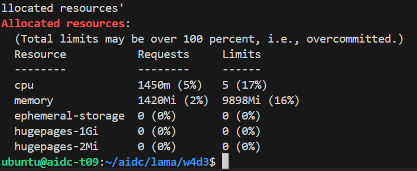

## Scheduling failures

### CPU request beyond node capacity

`impossible-cpu` remained `Pending`. The scheduler event reported **`Insufficient cpu`**, demonstrating that a valid manifest cannot run when its requested CPU cannot be reserved.

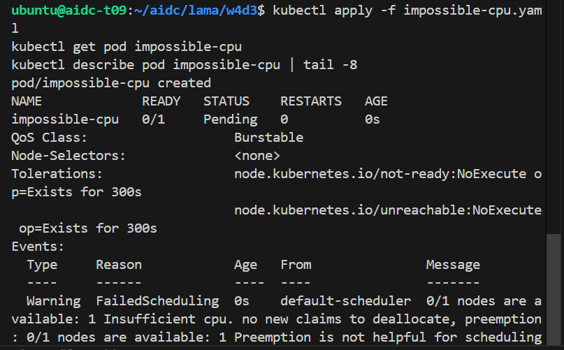

### GPU ledger contention

The cluster has one NVIDIA RTX A6000. While the shared team `vllm` Pod was Running and using the GPU allocation, `wants-a-gpu` remained `Pending`; its scheduler event reported **`Insufficient nvidia.com/gpu`**. This verifies accounting contention only—the shared team engine was not deleted or interrupted for a GPU handoff experiment.

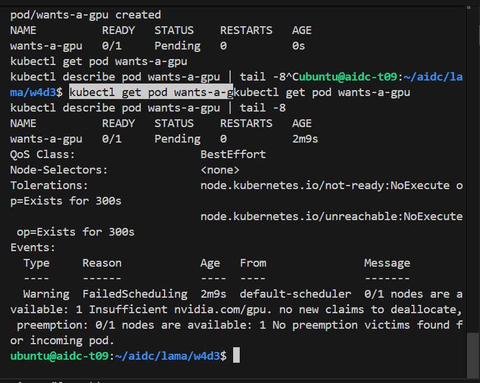

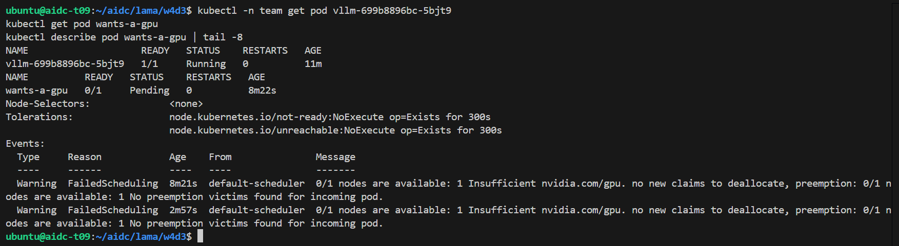

## CPU noisy-neighbour experiment

Twenty unlimited CPU burner Pods were measured, followed by twenty Pods limited to `500m` CPU each. Both runs completed with zero failed requests.

| Burner configuration | Requests | Failures | p50 | p95 |
| --- | ---: | ---: | ---: | ---: |
| Unlimited CPU burners | 567 | 0 | 3 ms | 4 ms |
| 20 burners limited to `500m` | 570 | 0 | 2 ms | 4 ms |

The p95 remained **4 ms** in both measured runs. The p50 changed by 1 ms, but this small difference does not justify a broad latency-improvement claim. CPU limits are documented here as isolation controls, not as proven p95 optimizers.

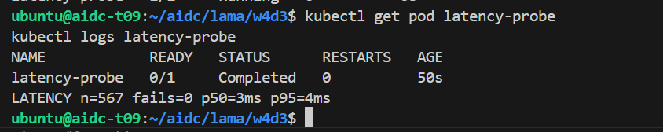

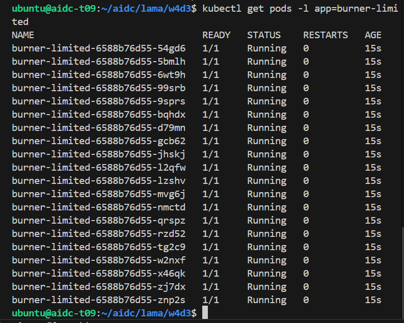

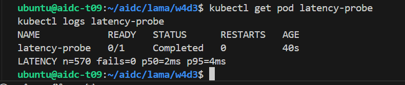

## Resource policy

The accompanying [policy.md](policy.md) prioritizes latency-sensitive serving, allows dashboard bursts when capacity is available, and throttles batch work first during contention. It explicitly preserves the measured p95 evidence: **4 ms unlimited** and **4 ms limited**.

## Shared team vLLM engine: verified, not recreated

The GPU engine was shared team infrastructure that was verified rather than independently created for this lab. The verified configuration was:

| Item | Verified value |
| --- | --- |
| Deployment / Service | `vllm` / `team-serving` (`ClusterIP`) |
| Pod / QoS | Running / `Guaranteed` |
| GPU visible in container | NVIDIA RTX A6000 |
| Model | `Qwen/Qwen2.5-1.5B-Instruct-AWQ` |
| Runtime options | AWQ, `half`, max model length 4096, GPU memory utilization 0.85, tool-call parser `hermes` |
| API checks | `/health` reachable; `/v1/models` returned Unauthorized without credentials and returned the configured model with authorized access |

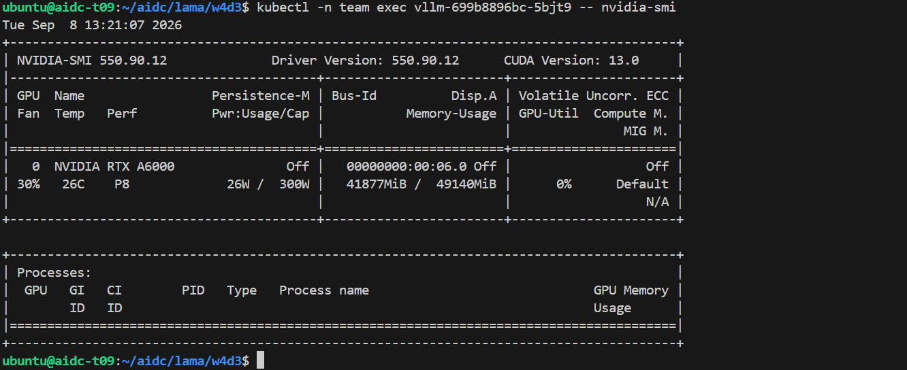

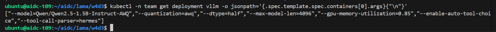

The authorized model-list result is shown without exposing the API-key value.

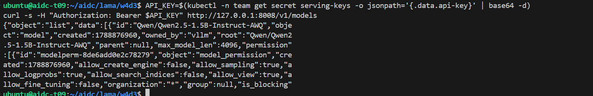

## Final verification

The supplied verifier confirmed the shared engine’s Guaranteed QoS, GPU visibility, safe Service name, and the GPU-overdraft failure mode. Its final result was **`GREEN CHECK: PASS`**.

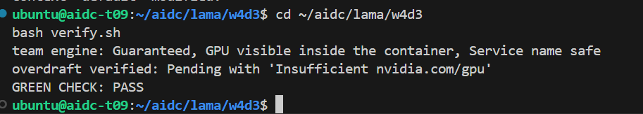

## Files

* `deployment.yaml` — W4D3 serving Deployment with requests of `250m` CPU and `256Mi` memory, and limits of `1` CPU and `512Mi` memory.
* `burner-unlimited.yaml` and `burner-limited.yaml` — supplied noisy-neighbour manifests; their required image placeholders were replaced with the image used in the lab.
* `impossible-cpu.yaml` and `wants-a-gpu.yaml` — supplied unschedulable-request manifests, retained as diagnostic inputs.
* `vllm-gpu.yaml` — supplied shared team engine reference; it contains a secret reference but no secret value.
* `verify.sh` — supplied W4D3 validator, retained unchanged.
* `policy.md` — evidence-based workload-priority policy.
