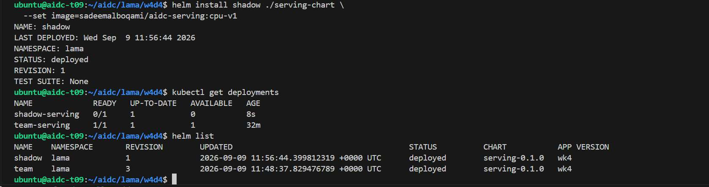
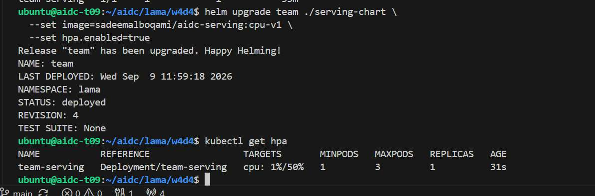
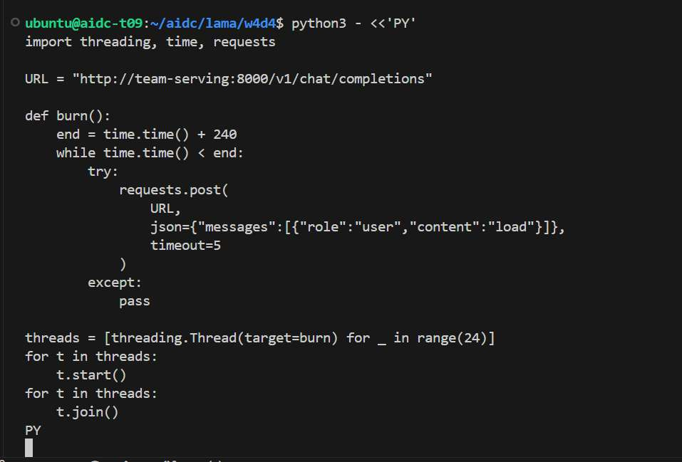
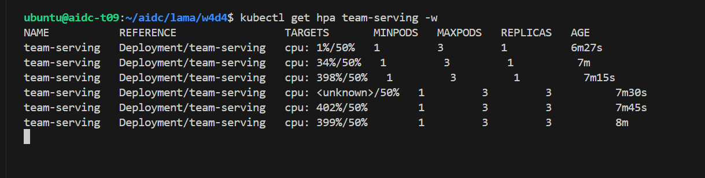
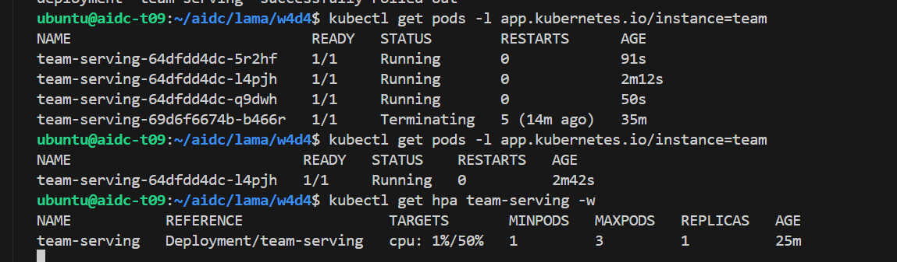
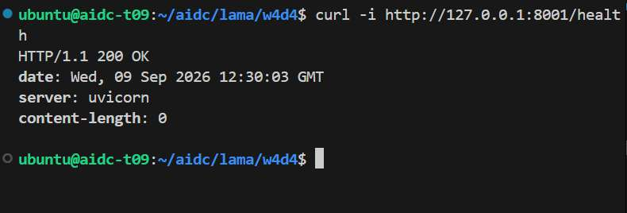
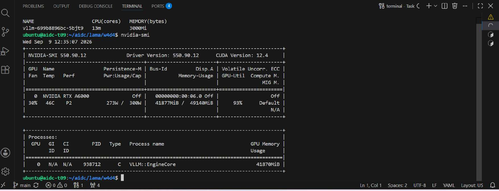
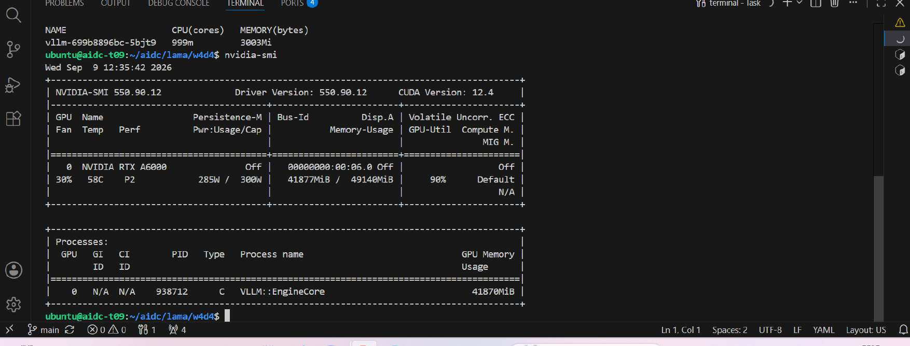

# Week 4 Day 4 — Helm Packaging and Horizontal Autoscaling

## Objective

Package the CPU echo serving workload as a reusable Helm chart, enable CPU-based horizontal autoscaling, and observe scale-out and scale-down under generated load. A separate failure-analysis exercise evaluated why CPU utilization is a poor autoscaling signal for the shared GPU-bound vLLM engine.

## Helm release and HPA configuration

The main Helm release was `team`. A temporary second release, `shadow`, demonstrated that one chart can create independently named Kubernetes resources through Helm release identity.



The completed `team` configuration used:

| Setting | Value |
| --- | --- |
| Serving image | `sadeemalboqami/aidc-serving:cpu-v1` |
| Backend | `MODEL_BACKEND=echo` |
| CPU request | `250m` |
| Memory request / limit | `256Mi` / `4Gi` |
| HPA replicas | minimum 1, maximum 3 |
| HPA CPU target | 50% |
| Liveness startup allowance | `initialDelaySeconds: 120` |



## Troubleshooting

The original memory limit was insufficient for reliable startup, so memory/OOM behavior was diagnosed and the serving limit was raised to `4Gi`. Scaled replicas also failed liveness checks before initialization completed. Pod Events identified the premature health-check timing, and the liveness initial delay was increased to 120 seconds. These changes allowed new replicas time to become healthy without removing the readiness, liveness, rolling-update, or pre-stop safeguards inherited by the chart.

## Observed autoscaling behavior

Load was generated against the `team-serving` Service in the `lama` namespace. This was the CPU echo workload—not GPU or real-model inference.



Under load, CPU utilization exceeded the 50% target and the HPA changed the desired replica count from 1 to 3. After load stopped and the configured stabilization period elapsed, it returned to 1 replica.





The serving health endpoint also returned HTTP 200 through a local port-forward.



The final supplied verifier preserved the observed result exactly:

```text
scale event observed: desired replicas 1 -> 3
GREEN CHECK: PASS
```

## GPU-bound vLLM failure analysis

The team’s existing vLLM engine used `Qwen/Qwen2.5-1.5B-Instruct-AWQ` and requested 4 CPU cores. Under load, observed samples ranged from approximately 13m to 999m CPU while GPU utilization was approximately 90–93%. The 999m sample is about 25% of the 4-core CPU request, so CPU did not remain at a single-digit percentage throughout the test.





These measurements show why CPU utilization is a poor scaling signal for this GPU-bound workload: the GPU can be highly utilized while CPU remains well below its request. The selected alternative signal was `vllm_num_requests_waiting`, with **2 waiting requests per replica** proposed as an initial target—not a measured production threshold. Production tuning should consider request latency, queue depth, GPU utilization, and GPU memory/KV-cache utilization together.

During this analysis, the existing `team-serving` Service in the shared `team` namespace had no endpoints because its selector did not match the vLLM Pod labels. It did not route the test load. To avoid unnecessary changes to shared infrastructure, the test used a direct port-forward to the existing vLLM Pod.

## Pre-stage public endpoint check

Before go-live, `https://t09.aidc.nadir.sh/health` returned the expected HTTP 503 “not live” holding response because nothing was listening on NodePort 30800. This confirmed that the tunnel/front-door path was working; it did **not** mean the application was publicly live during W4D4.

## Files

* `serving-chart/` — the supplied Helm chart with the completed W4D4 configuration.
* `metrics-server.yaml` — the supplied metrics-server resources required for HPA CPU metrics.
* `locustfile.py` — the supplied HTTP load definition.
* `verify.sh` — the supplied W4D4 validator, retained unchanged.
* `screenshots/` — selected evidence from the 15 supplied PDF pages.

The optional `values-tier1.yaml` Stretch was not completed and is not included.
