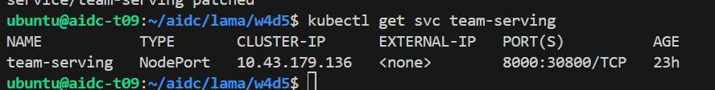
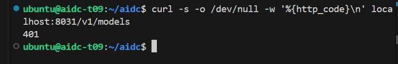
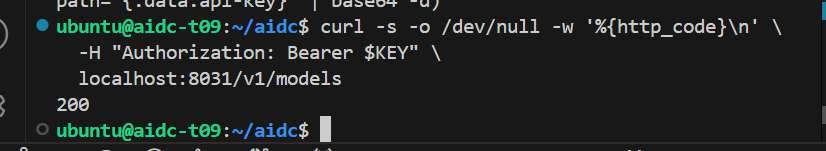
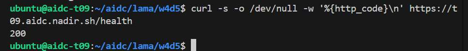
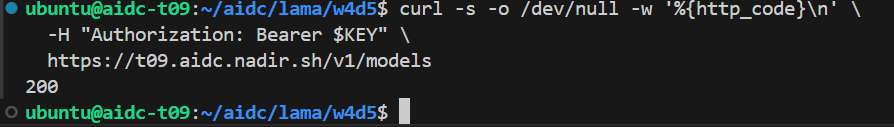
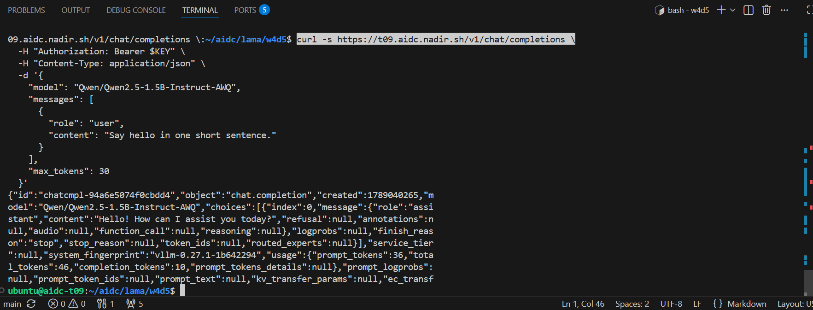
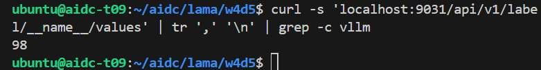
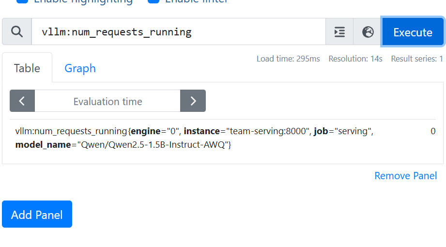
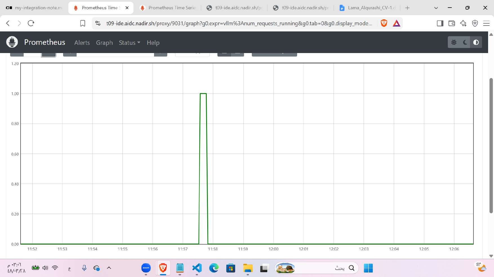
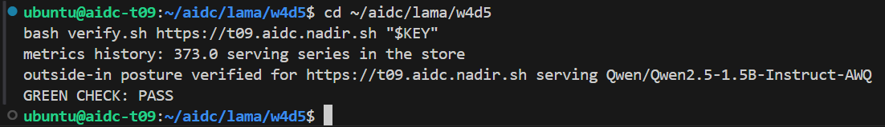

# Week 4 Day 5 — Go-Live, Authentication, and Metrics

## Objective

Expose and validate the serving API from outside the cluster, require bearer-key authentication for `/v1` endpoints, and integrate Prometheus so application metrics can be queried independently of the serving process.

## Environment

| Item | Observed value |
| --- | --- |
| Cluster / namespace | `aidc-t09` / `team` |
| Public service root | `https://t09.aidc.nadir.sh` |
| Kubernetes Service | `team-serving`, `NodePort` 30800 |
| Served model | `Qwen/Qwen2.5-1.5B-Instruct-AWQ` |
| Prometheus local access | `localhost:9031` through a port-forward |



## API authentication

The API key protects the model API so that only requests carrying the expected bearer key are accepted. The key itself is not stored in this repository or shown in the selected evidence.

A request to `/v1/models` without authentication returned HTTP 401. Supplying the expected key through the request environment returned HTTP 200.





## API validation

The public `/health` endpoint returned HTTP 200. Authenticated requests to `/v1/models` and `/v1/chat/completions` also returned successful responses, including a completion from the configured AWQ model.







## Prometheus integration

The supplied Prometheus configuration scrapes `team-serving:8000/metrics` every 15 seconds and stores the resulting time series on a persistent volume. Prometheus provides an external observation path for serving metrics rather than relying only on application responses or container logs.

The following Prometheus HTTP API query lists metric names known to the server:

```bash
curl -s localhost:9031/api/v1/label/__name__/values
```

During the lab, the response was split into individual names and filtered to count vLLM metrics; the observed count was 98.



## Metrics verification

Prometheus exposed vLLM series such as `vllm:num_requests_running`, labeled with the serving target and configured model. Generated requests produced visible activity in the recorded time series, confirming that the scrape path was collecting workload metrics.





## Troubleshooting

The API key was initially unavailable or not passed correctly in the second terminal, so authenticated request flow failed there. After the environment and request header were corrected, the protected endpoints returned HTTP 200. This was a client-terminal authentication issue; no unsupported server-side cause is attributed to it.

## Final verification

The supplied verifier checked the outside-in posture: open health access, rejection of an unkeyed model request, successful authenticated model and completion requests, stored Prometheus serving series, and the integration-note gate. The recorded output was:

```text
metrics history: 373.0 serving series in the store
outside-in posture verified for https://t09.aidc.nadir.sh serving Qwen/Qwen2.5-1.5B-Instruct-AWQ
GREEN CHECK: PASS
```



## Key takeaways

* Authentication behavior was verified from both failure and success paths without recording the key.
* Public health, model discovery, and chat completion returned successful HTTP responses.
* Prometheus scraped and exposed serving metrics, and request activity was observable in its time series.
* Environment variables used for credentials must be established independently in each terminal session.

## Files

* `prometheus-scrape.yaml` — supplied Prometheus scrape, storage, Deployment, and Service resources.
* `verify.sh` — supplied W4D5 integration validator, retained unchanged.
* `integration-note.md` — supplied handoff template, retained unchanged.
* `my-integration-note.md` — completed integration note used during the successful lab verification.
* `screenshots/` — selected evidence from the 18-page PDF.
